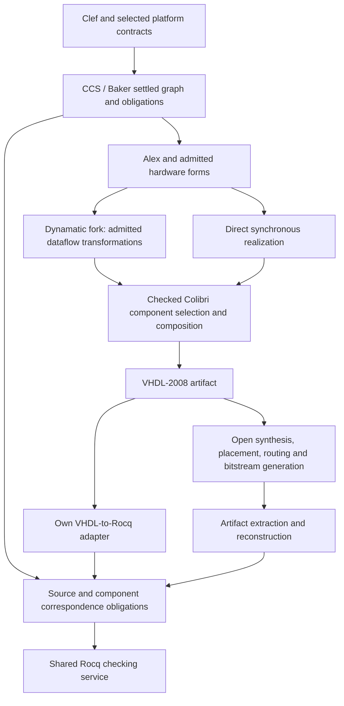

# FPGA targeting and artifact verification

**Status: Planned implementation; roadmap and research baseline, 2026-09-25.**

This workstream gives Composer an owned FPGA path that preserves Clef's settled
representations and carries its obligations into the circuit being delivered.
It combines a Clef-fed Dynamatic fork, a Colibri-centered implementation library,
a controlled VHDL-2008 emitter, and an independently implemented VHDL-to-Rocq
adapter. The final objective is evidence about the produced implementation,
including the supported FPGA configuration, with the proof boundary stated at
each stage.

Colibri is central to circuit realization in this profile. Its implementations,
properties and verification harnesses are the reference material to reuse and
extend. The backend admits a closed set of components and primitive operations;
it cannot silently bypass that set through unrelated IP or arbitrary emitted
HDL. Colibri itself is a library, not a compiler or a complete FPGA technology
mapper. Missing operations and proof contracts are explicit extension work.

This area owns the FPGA engineering plan. It shares operation admission with
[M-01](../PRDs/M-01-DialectAdmission.md), evidence composition and tool management
with [Proof composition](../Proof_Composition_Architecture.md), and semantic
obligation ownership with [Obligation residency](../Obligation_Residency_Design.md).
It creates neither another source semantics nor a second general proof service.

The [C-series acceptance criteria](../PRDs/C-Series-Acceptance.md#41-integrity-through-realization-colibri-fpga-and-ebpf)
apply this component/admission and artifact-correspondence discipline to the
current functional-language work. Colibri's concrete circuit implementations
and verification assets inform Baker/Alex integrity now, while each FPGA
realization milestone retains its own implementation and evidence gates.

## Decisions

1. Maintain an owned Dynamatic fork whose application input is Clef-derived
   semantic/dataflow structure. C/C++ application ingestion is optional upstream
   machinery, not a dependency of the Fidelity FPGA path. Existing compiler
   implementation languages and MLIR build dependencies are a separate concern.
2. Use a pinned, admitted Colibri component set as the canonical reusable circuit
   basis. Start by integrating the original VHDL; any later Clef port must carry
   a checked correspondence to its reference implementation and contracts.
3. Preserve CCS/Baker's inferred widths, numerical construction and proof
   identities. Alex consumes settled facts. Backend scheduling and optimization
   must discharge preservation obligations instead of changing their meaning.
4. Emit a documented VHDL-2008 subset directly from the admitted circuit forms.
   Unsupported operations fail admission. VHDL attributes carry provenance;
   theorems and checked certificates establish properties.
5. Build our own open VHDL-to-Rocq implementation, informed by VHDL2Rocq's
   published method. Its proprietary implementation is not a dependency. The
   Fidelity adapter must additionally handle the admitted sequential circuits.
6. Derive proof models from emitted or reconstructed artifacts and check their
   correspondence to source obligations. Two serializers of the same upstream
   graph do not by themselves validate the emitted circuit.
7. Keep Lean outside the required stack. Graphiti informs the treatment of local
   graph rewrites; its proof runtime is not being adopted.

## Architecture and evidence boundaries

HelloArty's fixed-clock Mealy design remains a useful first oracle; it need not
acquire dynamic scheduling to participate. Dynamatic adds an elastic dataflow
path under the same component and proof policy. Clock-sensitive bus controllers
retain their explicit timed semantics inside that composition.

The desired claim is: **every admitted target/profile delivers an artifact model
and independently checked evidence for its declared guarantees**. ELF and VHDL
provide major extraction paths. Neither format alone establishes instruction,
device, circuit, timing or whole-system correctness.

## Reading order

| Document | Ownership |
|---|---|
| [01 — Dynamatic fork](01_dynamatic_fork.md) | Fork boundary, reuse, Clef ingress, scheduling contracts and upstream maintenance |
| [02 — Colibri circuit basis](02_colibri_circuit_basis.md) | Canonical implementation set, component admission, proof reuse and ports |
| [03 — Widths and VHDL lowering](03_widths_and_vhdl_lowering.md) | Settled evidence handoff, supported operations, exact arithmetic and sequential semantics |
| [04 — VHDL-to-Rocq](04_vhdl_to_rocq.md) | Our adapter, lessons from the paper, component models and sequential extension |
| [05 — Artifact verification](05_artifact_verification.md) | HelloProof analogy, evidence bundles, certificate checking and netlist/bitstream boundaries |
| [06 — Platform and shared edges](06_platform_and_shared_edges.md) | Existing contract owners, Arty, portable peripherals, editor projection and other targets |
| [07 — Roadmap](07_roadmap.md) | Milestones, dependency order, positive and rejection gates, restart instructions |

## Baseline versus planned work

The following is an inspected source/documentation baseline, not a new compiler
or hardware acceptance run.

| Area | Existing evidence | New work in this series |
|---|---|---|
| HelloArty | Clocked state and pin-oriented design; recorded CIRCT-to-SystemVerilog/XDC acceptance | VHDL realization and checked source-to-circuit evidence |
| Width inference | [TypeMapping](../../src/MiddleEnd/Alex/CodeGeneration/TypeMapping.fs) and [hardware witnessing](../../src/MiddleEnd/Alex/Witnesses/HardwareModuleWitness.fs) consume range-derived widths | Complete width/representation/correspondence transport across the new backend |
| CIRCT backend | [Lowering](../../src/BackEnd/CIRCT/Lowering.fs) currently proceeds through SystemVerilog export | Independent VHDL emitter; preserve the recorded baseline while bringing it up |
| HelloProof | [MemoryMap.v](../../../ship-of-theseus/HelloProof/targets/rocq/MemoryMap.v) reproves extracted ELF layout facts | Circuit models, temporal obligations and later configuration reconstruction |
| Proof projection | [SMTTransfer](../../src/MiddleEnd/Alex/Traversal/SMTTransfer.fs) and the shared proof-composition design | Checked circuit relation and supported certificate reconstruction |
| Dynamatic / Colibri | Inspected upstream implementations and verification assets | No fork integration, universal component proof coverage or Rocq bridge is established here |
| Arty platform | [Product bindings](../../../Fidelity.Platform/Hardware/Products/Digilent/ArtyA7_100T/README.md) and [HelloArty profile](../../../Fidelity.Platform/Profiles/ArtyA7_HelloArty/README.md) | Hardware component declarations, electrical pad contracts and reusable peripheral realizations |

The platform acceptance records 25 emitted ports and constraints. It explicitly
does not establish the Prelude's proposed automatic UART report serialization.
Its 100 MHz physical oscillator and existing 25 MHz structural timing heuristic
are separate facts. This plan does not turn those facts into timing closure.

## Research and revision record

| Reference | Inspected identity and relevance |
|---|---|
| Composer | `c46485096c38dc2c9fef9db4ae60caa1905ca1a3` plus the pre-existing documentation working tree; source baseline only |
| [Dynamatic](https://github.com/EPFL-LAP/dynamatic/tree/2fac2911faf35b84156e08782a9fcfe8fc6174d8) | `2fac2911faf35b84156e08782a9fcfe8fc6174d8`; Handshake/dataflow infrastructure and structural RTL export |
| [Colibri](https://gitlab.com/colibri-cern/colibri/-/tree/3fa784121ccea86d9e65b2e0dc08d2a3327f5f2f) | `3fa784121ccea86d9e65b2e0dc08d2a3327f5f2f`; original implementation/property corpus |
| [VHDL2Rocq paper](https://hal.science/hal-05369274/file/main.pdf) | Sankur, Boyer, Faissole, VMCAI 2026; [published record](https://doi.org/10.1007/978-3-032-15700-3_14); architectural precedent, proprietary tool |
| [Graphiti](https://github.com/VCA-EPFL/graphiti) | Lessons about graph rewrite preservation, separate from adoption of its Lean implementation |
| [GHDL synthesis](https://ghdl.github.io/ghdl/using/Synthesis.html) | VHDL elaboration and Yosys export path; semantic extraction remains a declared trust boundary |
| [fasm2bels](https://github.com/chipsalliance/f4pga-xc-fasm2bels) | Configuration-to-circuit reconstruction; exact-device and primitive coverage must be established |

These are research pins, not an already tested release manifest. Executable
milestones must pin the full dependency closure, options, proof profile and
artifacts they actually validate.

The intended deployment flow is open source. Licensing is tracked per artifact:
Colibri defaults to CERN-OHL-W-2.0; it must not be described as uniformly
permissive. A literal Clef port retains source provenance and applicable license
obligations. The fork's bundled IP, generators, solvers and target databases need
the same explicit inventory. The proprietary VHDL2Rocq program supplies no code
to the implementation planned here.
